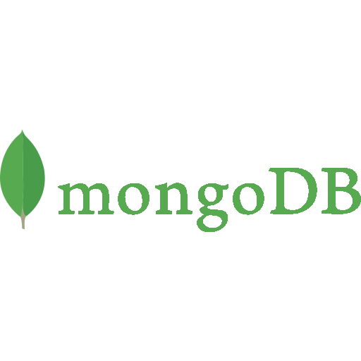
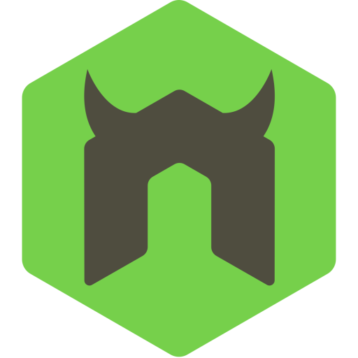

### Hi! 👋

I'm a webdev 👩🏻‍💻 with a background in art 🖼️ based in Philadelphia 🔔

|  |  |
| :--------------------------------------------------------------------------------------------------------------------------------------: | :--------------------------------------------------------------------------------------------------: |

## Current Technologies

             
