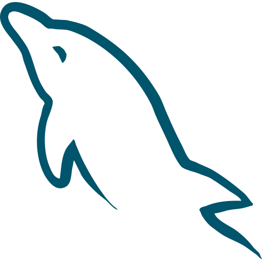

### Hey there! 👋

I'm a webdev with a background in art based in Philadelphia. I'm passionate about creating clean, visually pleasing websites that are easy and fun to use. Want to know more? Check out my portfolio - [karajsch.github.io](https://karajsch.github.io/) - and feel free to add me on [LinkedIn](https://www.linkedin.com/in/karajsch/).

|  |  |
| :--------------------------------------------------------------------------------------------------------------------------------------: | :--------------------------------------------------------------------------------------------------: |

## Current Technologies

             

Thanks to [Icon Mafia](https://iconscout.com/contributors/icon-mafia/icons) for the icons!
